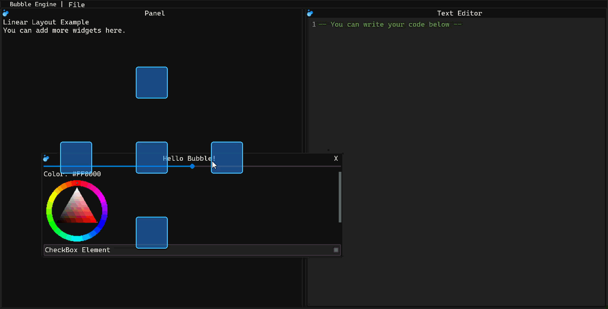

Bubble GUI
===

<p align="center"><b><em><q>I moved mountains to align a button.</q></em></b></p>



---

[](https://github.com/D4nielStone/cpp-bgui/actions/workflows/cmake-multi-platform.yml)
[](https://github.com/D4nielStone/cpp-bgui/stargazers)

| [Overview](#overview) – [Releases & Changelogs](#releases--changelogs) – [Usage](#usage) - [Back end](#back-end) |
|:--:|

---

## Overview

Bubble GUI is a graphics library for developing desktop applications with a graphical user interface.  
This project was created to improve my skills in **C++** and **OpenGL**.

Bubble GUI is designed (but not limited) to simplify the creation of **web-like interfaces** using native rendering.

### Programming Model

Bubble GUI works with a **retained** logic model:

| Part          | Model                  |
| ------------- | ---------------------- |
| Initial State | Store configuration    |
| Layout        | Processes positioning  |
| Rendering     | Render the drawdata queue |
| Final State   | Store position to compare in future updates |

> The final visual state is calculated only when generating draw requires.
---

## Releases & Changelogs

You can find the latest version on the [**Releases**](https://github.com/D4nielStone/cpp-bgui/releases/) page.

---

## Usage

**Bubble GUI uses the power of C++ templates to create an intuitive and easy-to-use API.**  
After initializing the library, you can set the main layout and add UI elements to it.

### Example

*Using GLFW & Opengl:*

- Initialize glfw and creates a window
- Initialize the library
- Set up the glfw and opengl/vulkan configs

#### GLFW and Opengl Preset

```cpp
/** backends are included based on the cmake build settings.
    EX: BGUI_USE_FREETYPE
        BGUI_USE_GLFW
        BGUI_USE_OPENGL
*/
#include <bgui.hpp>

int main() {
    // set up backends
    GLFWwindow* window = bgui::set_up_glfw(600, 400, "Todo List App");
    bgui::set_up_gl3();
    bgui::set_up_freetype();

    {
        bgui::scoped_interface ui;

        // Build interface here [...]

        while(!bgui::should_close_glfw()) {
            // update the context with glfw
            bgui::glfw_update(bgui::get_context());
            // load fonts requested by text widgets before building draw data
            bgui::load_font_queue();
            // update the layout
            bgui::on_update();
            // render with opengl3
            bgui::gl3_render(bgui::get_draw_data());
            bgui::swap_glfw();
        }
    }
    bgui::shutdown_gl3();
    bgui::shutdown_glfw();
    return 0;
}
```

#### Logging

BGUI logs are enabled by default in Debug builds and disabled in other build configurations. Change the setting at runtime with `bgui::set_logs_enabled(bool)` and query it with `bgui::logs_enabled()`.

```cpp
bgui::set_logs_enabled(false);
```

- Configure the layout as you want

```cpp
    bgui::layout& root = bgui::get_layout();

    // Keep each handle alive while its element should remain in the layout.
    auto panel = root.add<bgui::linear>(bgui::orientation::vertical);
    panel->style.layout.set_padding(10, 2);
    panel->require_width(bgui::mode::pixel, 300.f);
    panel->require_height(bgui::mode::match_parent);

    // layout are invisible by default
    panel->set_visible(true);

    auto txt = panel->add<bgui::text>("Linear Layout Example", 0.35f);
    txt->require_width(bgui::mode::match_parent);
    txt->set_alignment(bgui::alignment::center);
    auto button = panel->add<bgui::button>("Button Example", 0.35f, [](){});
    button->require_width(bgui::mode::match_parent);

    // window widget
    auto win = root.add<bgui::window>("Hello Bubble!");
    auto window2 = root.add<bgui::window>("win2");
    auto window3 = root.add<bgui::window>("win3");
    auto window4 = root.add<bgui::window>("win4");
    win->get_context().style.layout.set_padding(10, 10);
    auto window_text = win->add<bgui::text>("This is a window widget example.", 0.35f);
    auto txt2 = win->add<bgui::text>("Centered text", 0.35f);
    txt2->set_alignment(bgui::alignment::center);
    txt2->require_width(bgui::mode::stretch);
    auto button2 = win->add<bgui::button>("Button inside window", 0.35f, [](){});
    button2->require_width(bgui::mode::match_parent);

    // Slider and progress bar share an explicit value range.
    auto progress = win->add<bgui::progress_bar>(0.f, 100.f, 35.f);
    auto slider = win->add<bgui::slider>(0.f, 100.f, 35.f);
    slider->set_step(5.f);
    slider->set_on_change([&progress](float value) {
        progress->set_value(value);
    });

    // Put vertical controls in a row with an explicit height.
    auto vertical_controls = win->add<bgui::linear>(bgui::orientation::horizontal);
    vertical_controls->style.layout.require_width(bgui::mode::match_parent);
    vertical_controls->style.layout.require_height(bgui::mode::pixel, 110.f);
    auto vertical_slider = vertical_controls->add<bgui::slider>(
        -1.f, 1.f, 0.f, bgui::orientation::vertical);
    vertical_slider->style.layout.require_mode(bgui::mode::pixel, bgui::mode::pixel);
    vertical_slider->style.layout.require_size(28.f, 110.f);
    auto vertical_progress = vertical_controls->add<bgui::progress_bar>(
        0.f, 1.f, 0.65f, bgui::orientation::vertical);
    vertical_progress->style.layout.require_mode(bgui::mode::pixel, bgui::mode::pixel);
    vertical_progress->style.layout.require_size(28.f, 110.f);

    // style must be applyed in the end
    bgui::cascade_style(bgui::dark_style);
```

### Slider and progress bar

`bgui::slider` is an interactive, mouse-draggable control. `bgui::progress_bar`
displays a value without receiving input. Both accept a minimum, maximum,
initial value and orientation; their default orientations are horizontal.
Their appearance follows the `[type.slider]` and `[type.progressbar]`
sections of the active theme.

```cpp
auto progress = panel->add<bgui::progress_bar>(0.f, 100.f, 25.f);
auto slider = panel->add<bgui::slider>(0.f, 100.f, 25.f);

slider->set_step(5.f); // Snap to multiples of 5 from the minimum.
slider->set_on_change([&progress](float value) {
    progress->set_value(value);
});

slider->set_range(-50.f, 50.f);
slider->set_value(10.f);
const float current = slider->get_value();
const float minimum = slider->get_minimum();
const float maximum = slider->get_maximum();
const float step = slider->get_step();

auto vertical = panel->add<bgui::slider>(
    0.f, 1.f, 0.5f, bgui::orientation::vertical);
auto vertical_progress = panel->add<bgui::progress_bar>(
    0.f, 1.f, 0.5f, bgui::orientation::vertical);
```

The slider API also includes `set_range(minimum, maximum)`,
`set_value(value)`, `set_step(step)`, `set_on_change(callback)`, and
`get_orientation()`. A step of `0.f` disables snapping. The progress bar
provides `set_range`, `set_value`, `get_minimum`, `get_maximum`, `get_value`
and `get_orientation`. Its fill is updated by setting its value.

Both controls clamp finite values to their configured range. Constructors and
`set_range` throw `std::invalid_argument` when either endpoint is non-finite or
the maximum is not greater than the minimum. Non-finite values are rejected;
the slider also rejects negative or non-finite steps. A slider's change
callback runs only when its effective value changes, including changes caused
by updating its range or step.

### Font families and styles

The FreeType backend keeps loaded fonts in a resolution-aware cache and lets
applications select a discovered system face by its family/style name:

```cpp
auto& regular = bgui::ft_load_system_font("DejaVu Sans Regular");
auto& bold_italic = bgui::ft_load_system_font("DejaVu Sans Bold Italic");
```

Supported styles include `regular`, `bold`, `italic`, `bold_italic`, `light`,
`semibold`, `black` and `thin`. Loaded faces retain their family and style
metadata in `bgui::font`, and repeated requests reuse the cached atlas.

FreeType prefers an installed monospace family for the `"default"` font
(including Consolas, DejaVu Sans Mono and Courier New). If no known monospace
family is found, it falls back to the available system fonts.

The first successfully loaded face is registered as the deterministic
`"default"` fallback used by text widgets and by unresolved font requests.
Font requests queued by text widgets are processed with
`bgui::load_font_queue()` before `bgui::on_update()`.
Applications can observe successful loads without owning font memory:

```cpp
bgui::font_manager::get_instance().set_font_loaded_callback(
    [](const bgui::font& loaded) {
        std::cout << loaded.family << " / " << loaded.style << '\n';
    }
);
```

### Runtime themes

Theme files are stored in `assets/themes` and loaded at runtime. The built-in
helpers load `dark.theme` and `light.theme`, while applications can load a
custom file with:

```cpp
auto custom_theme = bgui::load_theme("assets/themes/custom.theme");
bgui::style_manager::get_instance().apply_theme(custom_theme);
```

When building with CMake, the `assets` directory is copied to the build
directory. Files can be edited or replaced without recompiling the library.

The complete interface scale can be changed at runtime. A value of `1.0f`
keeps the default size, while `1.5f` enlarges layout metrics, borders and
text:

```cpp
bgui::set_global_scale(1.5f);
```

The scale must be greater than zero and can be queried with
`bgui::get_global_scale()`.

## Back end

Bubble's GUI is library-agnostic, so if you want to create a system window or render the elements, you must use ***back ends***.
You'll be able to set these options on the cmake configuration:
```cmake
BGUI_USE_OPENGL
BGUI_USE_GLFW
BGUI_USE_FREETYPE
BGUI_USE_VULKAN
```

Detailed backend documentation is available in
[`backend/README.md`](backend/README.md), with a separate README for GLFW,
OpenGL 3, FreeType, Vulkan and the Null backend.

---
# Multiline input and syntax highlighting

Use `bgui::input_mode::multiline` to enable newline insertion and vertical
cursor navigation in an input box. A window can load ordered regex-based
highlight rules with `use_highlight_config`; the rules are applied to its
existing input boxes and to input boxes added afterward.

Highlight configuration files use JSON with an ordered `rules` array. Each
rule has a `pattern` (a C++ ECMAScript regular expression) and a `color` in
`#RRGGBB` or `#RRGGBBAA` format. Earlier rules take precedence where matches
overlap. Relative paths are resolved using the regular `assets` search paths.

```json
{
  "rules": [
    { "pattern": "--.*", "color": "#6A9955" },
    { "pattern": "\\b(local|function|return)\\b", "color": "#569CD6" }
  ]
}
```
